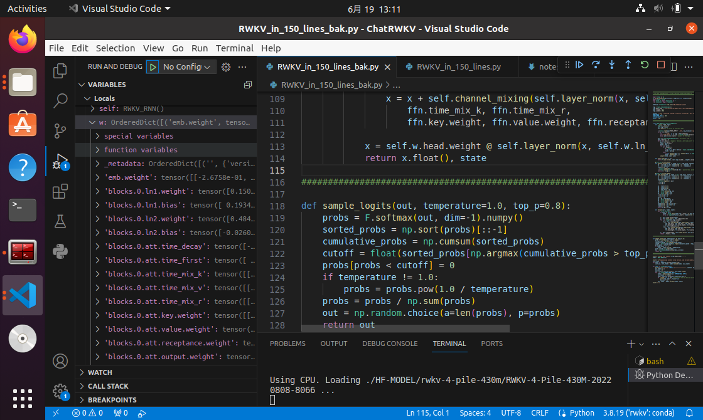
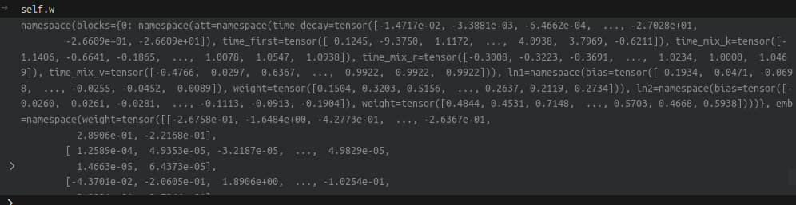

## RWKV_in_150_lines

```Python
w = torch.load(args.MODEL_NAME + '.pth', map_location='cpu')
```

w is a ordered dict



### namespace operation

if a key in namespace w is "emb.weights", then we have the following in self.w namespace:

namespace(blocks={}, emb=namespace(weight=tensor([[-2.6758e-01, -1.6484e+00, -4.2773e-01,  ..., -2.6367e-01,
          2.8906e-01, -2.2168e-01],
        [ 1.2589e-04,  4.9353e-05, -3.2187e-05,  ...,  4.9829e-05,
          1.4663e-05,  6.4373e-05],
        [-4.3701e-02, -2.0605e-01,  1.8906e+00,  ..., -1.0254e-01,
          3.2031e-01, -2.7344e-01],
        ...,
        [ 1.2109e-01, -7.7734e-01,  1.4062e+00,  ..., -2.2461e-01,
          1.5527e-01,  1.7822e-02],
        [ 2.2754e-01, -7.1484e-01,  1.3281e+00,  ..., -1.4746e-01,
          3.1836e-01,  1.3245e-02],
        [ 3.8867e-01, -8.7891e-01,  1.4766e+00,  ..., -6.5234e-01,
          2.1777e-01, -3.7842e-02]])))

so on nesting.., blocks 0 has att namespace, ln1 namespace, ln2 namespace..


